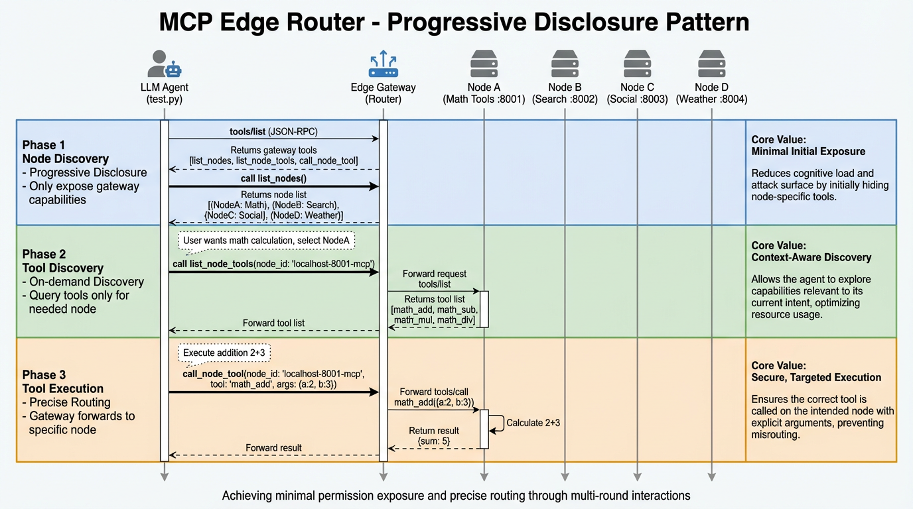
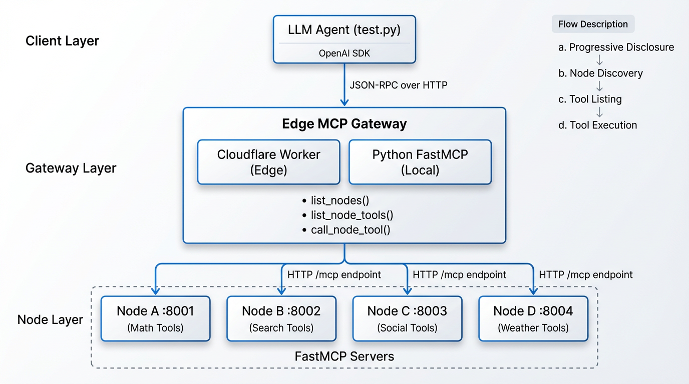

# MCP 边缘路由 Demo

一个最小可运行的 Edge MCP 网关 + 后端 MCP 节点示例。网关支持渐进式披露：先暴露节点列表，再按节点返回工具列表，并将工具调用转发到对应节点。

## 架构概览



上图展示了 MCP Edge Router 的多轮交互模式和渐进式披露机制，说明了 LLM Agent 如何通过网关逐步发现节点、查询工具并执行操作。

## 项目结构

- `edge-worker/` Cloudflare Worker MCP 网关（JSON-RPC / Streamable HTTP）
  - `src/worker.js` 网关入口（JSON-RPC 路由）
  - `src/tool-handler.js` 工具分发（`list_nodes` / `list_node_tools` / `call_node_tool`）
  - `src/node-service.js` 节点发现、缓存、节点调用
  - `src/mcp-client.js` 上游 JSON-RPC 与超时控制
  - `src/redis.js` Upstash Redis 读写封装
  - `src/constants.js` / `src/helpers.js` 常量与通用函数
- `nodes/` NodeA–D FastMCP 服务器（HTTP `/mcp`）
- `mcp/edge_gateway.py` Python 网关（本地参考）
- `test.py` 简单智能体（OpenAI SDK + MCP）
- `bench_cache.py` 缓存前后耗时对比脚本
- `start_all.ps1` 一键启动 NodeA–D + 本地 Worker



## 依赖

- Python 3.10+
- Node.js 18+
- Python 依赖在 `requirements.txt`
- Wrangler（可用 `npx` 运行）

## 安装 Python 依赖（推荐 `uv` 单环境）

```bash
uv venv .venv
uv pip install -r requirements.txt --python .venv/bin/python
source .venv/bin/activate
```

如果使用 conda，也可沿用：

```bash
conda create -n llm-agent-env python=3.11
conda activate llm-agent-env
pip install -r requirements.txt
```

## 本地启动

### 1）启动 NodeA–D + Worker

macOS / Linux（推荐，单环境）：

```bash
source .venv/bin/activate
python nodes/node_a/main.py
python nodes/node_b/main.py
python nodes/node_c/main.py
python nodes/node_d/main.py
cd edge-worker && npx wrangler dev --local
```

Windows PowerShell（已有脚本）：

```powershell
powershell -ExecutionPolicy Bypass -File .\start_all.ps1
```

说明：`start_all.ps1` 依赖 `conda run -n llm-agent-env ...`。如果不使用 conda，请手动分别启动各节点。

### 2）验证 MCP 网关（JSON-RPC）

```bash
# tools/list（网关工具）
curl -s -X POST http://localhost:8787/mcp \
  -H "content-type: application/json" \
  -d '{"jsonrpc":"2.0","id":"1","method":"tools/list","params":{}}'

# list_nodes（渐进式披露）
curl -s -X POST http://localhost:8787/mcp \
  -H "content-type: application/json" \
  -d '{"jsonrpc":"2.0","id":"2","method":"tools/call","params":{"name":"list_nodes","arguments":{}}}'

# list_node_tools
curl -s -X POST http://localhost:8787/mcp \
  -H "content-type: application/json" \
  -d '{"jsonrpc":"2.0","id":"3","method":"tools/call","params":{"name":"list_node_tools","arguments":{"node_id":"localhost-8001-mcp"}}}'

# call_node_tool
curl -s -X POST http://localhost:8787/mcp \
  -H "content-type: application/json" \
  -d '{"jsonrpc":"2.0","id":"4","method":"tools/call","params":{"name":"call_node_tool","arguments":{"node_id":"localhost-8001-mcp","tool_name":"math_add","arguments":{"a":2,"b":3}}}}'
```

## 智能体测试（OpenAI SDK + OpenRouter 兼容）

1）在仓库根目录创建 `.env`（参考 `.env.example`）：

```ini
OPENROUTER_API_KEY=your_key
OPENROUTER_MODEL=gemini-3-flash-preview
OPENROUTER_BASE_URL=https://api.chataiapi.com/v1
MCP_URL=http://localhost:8787/mcp
```

2）运行：

```powershell
python .\test.py
```

可扩展的 MCP 服务器配置示例见 `mcp/mcp_config.example.json`（包含远端 MCP 示例）。

## Cloudflare Worker

在 `edge-worker/` 目录下：

```bash
npx wrangler dev --local
```

配置 MCP 节点 URL（`edge-worker/wrangler.toml`）：

```toml
[vars]
MCP_NODES = '["http://localhost:8001/mcp","http://localhost:8002/mcp","http://localhost:8003/mcp","http://localhost:8004/mcp"]'
NODE_DISCOVERY_CACHE_TTL = "10"
NODE_TOOLS_CACHE_TTL = "30"
UPSTREAM_TIMEOUT_MS = "5000"
```

可选：启用 Upstash Redis 缓存（网关侧，`wrangler dev --local`）：

```bash
cd edge-worker
cp .dev.vars.example .dev.vars
# 填写真实值
# UPSTASH_REDIS_REST_URL=...
# UPSTASH_REDIS_REST_TOKEN=...
```

说明：
- 未配置 Upstash 变量时，网关自动回退为无 Redis 缓存模式。
- `edge-worker/.dev.vars` 已加入 `.gitignore`，不会进入版本库。
- 云上部署时再使用 `wrangler secret put ...` 写入生产/预发环境。

## 缓存效果基准测试

在仓库根目录执行：

```bash
source .venv/bin/activate
python bench_cache.py --mcp-url http://localhost:8787/mcp --rounds 20
```

脚本会输出：
- `list_nodes` 冷启动 vs 热请求平均/P95
- `list_node_tools` 冷启动 vs 热请求平均/P95
- 冷热加速比（speedup）

## 说明

- 网关请求下游节点时需要 `Accept: application/json, text/event-stream`。
- 节点描述来自 FastMCP 的 `instructions`。
- 节点 ID 来自 URL（稳定且可复用）。
